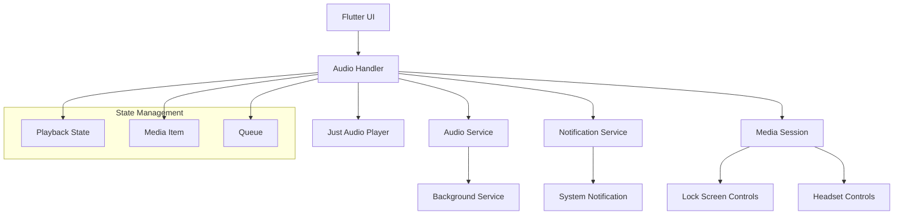

# وثيقة التصميم

## نظرة عامة

يهدف هذا التصميم إلى إصلاح وتحسين مشغل القرآن في الإشعارات لتطبيق Flutter الإسلامي. سيتم التركيز على ضمان التكامل الصحيح بين AudioService و just_audio لتوفير تجربة تشغيل سلسة في الخلفية مع إشعارات تفاعلية تعرض معلومات القرآن بوضوح.

المشكلة الحالية تتمثل في عدم عمل أزرار التحكم في الإشعارات بشكل صحيح، وعدم تحديث معلومات السورة والآية في الإشعار، وعدم استمرار التشغيل بشكل موثوق في الخلفية.

## البنية المعمارية

### المكونات الرئيسية



### تدفق البيانات

1. **من واجهة المستخدم إلى Audio Handler**: طلبات التحكم (تشغيل، إيقاف، تالي، سابق)
2. **من Audio Handler إلى Just Audio**: تنفيذ العمليات الصوتية الفعلية
3. **من Audio Handler إلى النظام**: بث حالة التشغيل والمعلومات للإشعارات
4. **من النظام إلى Audio Handler**: استقبال أوامر التحكم من الإشعارات والأجهزة الخارجية

## المكونات والواجهات

### 1. QuranAudioHandler

```dart
class QuranAudioHandler extends BaseAudioHandler 
    with QueueHandler, SeekHandler {
  
  final AudioPlayer _player = AudioPlayer();
  final QuranDataService _quranService;
  
  // Core playback methods
  @override
  Future<void> play() async;
  
  @override
  Future<void> pause() async;
  
  @override
  Future<void> stop() async;
  
  @override
  Future<void> skipToNext() async;
  
  @override
  Future<void> skipToPrevious() async;
  
  @override
  Future<void> seek(Duration position) async;
  
  // Queue management
  @override
  Future<void> skipToQueueItem(int index) async;
  
  // State broadcasting methods
  void _broadcastState();
  void _updateMediaItem(QuranVerse verse);
  void _updateQueue(List<QuranVerse> verses);
}
```

### 2. QuranMediaItem

```dart
class QuranMediaItem {
  final String surahName;
  final int surahNumber;
  final int verseNumber;
  final String audioUrl;
  final Duration duration;
  final String? artworkUrl;
  
  MediaItem toMediaItem() {
    return MediaItem(
      id: audioUrl,
      title: '$surahName - آية $verseNumber',
      artist: 'القرآن الكريم',
      album: 'سورة $surahName',
      duration: duration,
      artUri: artworkUrl != null ? Uri.parse(artworkUrl) : null,
      extras: {
        'surahNumber': surahNumber,
        'verseNumber': verseNumber,
        'surahName': surahName,
      },
    );
  }
}
```

### 3. NotificationManager

```dart
class NotificationManager {
  static const String channelId = 'quran_playback';
  static const String channelName = 'تشغيل القرآن';
  
  static Future<void> initialize() async;
  static Future<void> updateNotification(MediaItem item, PlaybackState state) async;
  static Future<void> hideNotification() async;
}
```

### 4. QuranPlaybackService

```dart
class QuranPlaybackService {
  static QuranAudioHandler? _audioHandler;
  
  static Future<void> initialize() async {
    _audioHandler = await AudioService.init(
      builder: () => QuranAudioHandler(),
      config: const AudioServiceConfig(
        androidNotificationChannelId: 'com.islamicapp.quran.audio',
        androidNotificationChannelName: 'تشغيل القرآن الكريم',
        androidNotificationOngoing: true,
        androidStopForegroundOnPause: false,
        androidNotificationClickStartsActivity: true,
        androidNotificationIcon: 'drawable/ic_quran_notification',
        androidShowNotificationBadge: true,
      ),
    );
  }
  
  static QuranAudioHandler get audioHandler => _audioHandler!;
}
```

## نماذج البيانات

### QuranVerse

```dart
class QuranVerse {
  final int surahNumber;
  final String surahName;
  final int verseNumber;
  final String arabicText;
  final String audioUrl;
  final Duration duration;
  final String? translation;
  
  const QuranVerse({
    required this.surahNumber,
    required this.surahName,
    required this.verseNumber,
    required this.arabicText,
    required this.audioUrl,
    required this.duration,
    this.translation,
  });
}
```

### PlaybackSession

```dart
class PlaybackSession {
  final List<QuranVerse> playlist;
  final int currentIndex;
  final Duration currentPosition;
  final bool isPlaying;
  final AudioServiceRepeatMode repeatMode;
  final AudioServiceShuffleMode shuffleMode;
  
  const PlaybackSession({
    required this.playlist,
    required this.currentIndex,
    required this.currentPosition,
    required this.isPlaying,
    this.repeatMode = AudioServiceRepeatMode.none,
    this.shuffleMode = AudioServiceShuffleMode.none,
  });
}
```

## خصائص الصحة

*الخاصية هي سمة أو سلوك يجب أن يكون صحيحاً عبر جميع عمليات التنفيذ الصالحة للنظام - في الأساس، بيان رسمي حول ما يجب أن يفعله النظام. تعمل الخصائص كجسر بين المواصفات المقروءة بواسطة الإنسان وضمانات الصحة القابلة للتحقق آلياً.*

سأقوم الآن بتحليل معايير القبول لتحديد الخصائص القابلة للاختبار.

بناءً على تحليل معايير القبول، تم تحديد الخصائص التالية القابلة للاختبار:

### الخاصية 1: عرض معلومات الإشعار الصحيحة
*لأي* آية قرآنية يتم تشغيلها، يجب أن يعرض الإشعار اسم السورة ورقم الآية والمعلومات الصحيحة
**تتحقق من: المتطلبات 1.1، 3.1، 3.2**

### الخاصية 2: تحديث الإشعار عند تغيير المحتوى
*لأي* تغيير في المحتوى المُشغل، يجب أن يتم تحديث معلومات الإشعار خلال ثانية واحدة
**تتحقق من: المتطلبات 1.4، 3.3**

### الخاصية 3: استجابة أزرار التحكم في الإشعار
*لأي* زر تحكم في الإشعار (تشغيل/إيقاف، التالي، السابق)، يجب أن يؤدي الضغط عليه إلى تنفيذ الإجراء المطلوب فوراً
**تتحقق من: المتطلبات 2.1، 2.2، 2.3**

### الخاصية 4: مزامنة الحالة بين المكونات
*لأي* تغيير في حالة التشغيل من أي مصدر (واجهة المستخدم، الإشعار، أزرار الهاتف)، يجب أن تتم مزامنة الحالة عبر جميع المكونات فوراً
**تتحقق من: المتطلبات 2.4، 4.4، 5.1، 5.2**

### الخاصية 5: استمرار التشغيل في الخلفية
*لأي* حالة تشغيل نشطة، يجب أن يستمر التشغيل والتحكم عند انتقال التطبيق للخلفية
**تتحقق من: المتطلبات 1.2، 4.1، 4.2**

### الخاصية 6: تنظيف الموارد عند الإنهاء
*لأي* عملية إنهاء للتطبيق أو إيقاف للتشغيل، يجب أن يتم تنظيف جميع الموارد وإزالة الإشعارات
**تتحقق من: المتطلبات 1.3، 4.3**

### الخاصية 7: استعادة الجلسة عند بدء التطبيق
*لأي* جلسة تشغيل سابقة محفوظة، يجب أن يتم استعادتها بشكل صحيح عند إعادة تشغيل التطبيق
**تتحقق من: المتطلبات 5.4**

### الخاصية 8: معالجة الأخطاء بأمان
*لأي* خطأ يحدث في النظام (فشل تحميل، انقطاع شبكة، خطأ خدمة)، يجب أن يتم التعامل معه بأمان مع الحفاظ على حالة متسقة
**تتحقق من: المتطلبات 2.5، 5.3، 6.1، 6.2، 6.3، 6.4**

## معالجة الأخطاء

### أنواع الأخطاء المتوقعة

1. **أخطاء الشبكة**: انقطاع الاتصال أثناء تحميل الملفات الصوتية
2. **أخطاء الملفات**: ملفات صوتية تالفة أو غير موجودة
3. **أخطاء النظام**: فشل في خدمة الصوت أو الإشعارات
4. **أخطاء الذاكرة**: نفاد الذاكرة أثناء التشغيل

### استراتيجيات المعالجة

```dart
class ErrorHandler {
  static Future<void> handleAudioError(AudioError error) async {
    switch (error.type) {
      case AudioErrorType.network:
        await _handleNetworkError(error);
        break;
      case AudioErrorType.fileNotFound:
        await _handleFileError(error);
        break;
      case AudioErrorType.serviceFailure:
        await _handleServiceError(error);
        break;
      default:
        await _handleGenericError(error);
    }
  }
  
  static Future<void> _handleNetworkError(AudioError error) async {
    // إيقاف مؤقت ومحاولة إعادة الاتصال
    await QuranPlaybackService.audioHandler.pause();
    // عرض رسالة للمستخدم
    NotificationManager.showErrorNotification('انقطع الاتصال بالإنترنت');
    // محاولة إعادة الاتصال بعد 5 ثوان
    Timer(Duration(seconds: 5), () => _retryConnection());
  }
}
```

## استراتيجية الاختبار

### نهج الاختبار المزدوج

سيتم استخدام نهج مزدوج للاختبار يجمع بين:

1. **اختبارات الوحدة**: للتحقق من أمثلة محددة وحالات الحافة وشروط الخطأ
2. **اختبارات الخصائص**: للتحقق من الخصائص العامة عبر جميع المدخلات

### اختبارات الوحدة

- اختبار أمثلة محددة لتشغيل آيات معينة
- اختبار حالات الحافة مثل الآية الأولى والأخيرة في السورة
- اختبار شروط الخطأ مثل ملفات صوتية مفقودة
- اختبار نقاط التكامل بين المكونات

### اختبارات الخصائص

- **مكتبة الاختبار**: سيتم استخدام مكتبة `test` مع `fake_async` لـ Flutter
- **عدد التكرارات**: 100 تكرار كحد أدنى لكل اختبار خاصية
- **وسم الاختبارات**: كل اختبار خاصية يجب أن يحتوي على تعليق يشير إلى الخاصية المقابلة
- **تنسيق الوسم**: **Feature: quran-notification-player, Property {number}: {property_text}**

### أمثلة على اختبارات الخصائص

```dart
// Feature: quran-notification-player, Property 1: عرض معلومات الإشعار الصحيحة
testWidgets('notification displays correct verse information for any verse', (tester) async {
  // إنشاء آية عشوائية
  final verse = generateRandomVerse();
  
  // بدء التشغيل
  await audioHandler.playMediaItem(verse.toMediaItem());
  
  // التحقق من أن الإشعار يعرض المعلومات الصحيحة
  expect(notificationTitle, contains(verse.surahName));
  expect(notificationTitle, contains('آية ${verse.verseNumber}'));
});

// Feature: quran-notification-player, Property 3: استجابة أزرار التحكم في الإشعار
testWidgets('notification controls respond correctly for any playback state', (tester) async {
  // إنشاء حالة تشغيل عشوائية
  final initialState = generateRandomPlaybackState();
  await audioHandler.setPlaybackState(initialState);
  
  // محاكاة الضغط على زر التحكم
  await simulateNotificationButtonPress(MediaControl.pause);
  
  // التحقق من تغيير الحالة
  expect(audioHandler.playbackState.value.playing, isFalse);
});
```

### متطلبات التكوين

- كل اختبار خاصية يجب أن ينفذ 100 تكرار كحد أدنى
- كل اختبار خاصية يجب أن يشير إلى خاصية التصميم المقابلة
- اختبارات الوحدة واختبارات الخصائص مكملة لبعضها البعض (كلاهما مطلوب)
- اختبارات الوحدة تركز على أمثلة محددة وحالات الحافة
- اختبارات الخصائص تركز على الخصائص العامة عبر جميع المدخلات
- معاً: تغطية شاملة (اختبارات الوحدة تكتشف الأخطاء المحددة، اختبارات الخصائص تتحقق من الصحة العامة)